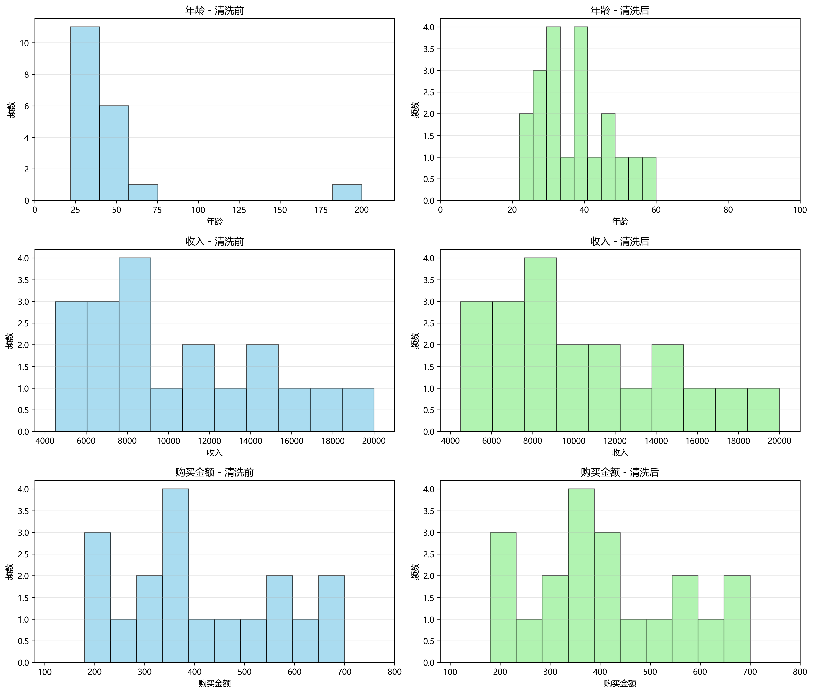

# 数据清洗项目

## Project Overview

这是一个基于 AI Agent 思维构建的自动化数据治理系统，用于智能处理和清洗数据。

## Key Features

- **异常值拦截**：利用 3σ 原则进行统计学层面的异常值识别和处理
- **数据清洗**：多格式日期解析与缺失值智能填充
- **可视化分析**：AI 辅助生成的自动化对比分析看板

## Quick Start

### 安装依赖

```bash
pip install pandas numpy matplotlib
```

### 运行方法

在命令行中执行：

```bash
python clean.py
```

或直接双击 `run.bat` 文件一键运行。

## Screenshots

### 清洗前后对比直方图



## 项目文件

- `clean.py` - 核心数据清洗脚本
- `dirty_data.csv` - 包含脏数据的原始文件
- `final_data.csv` - 清洗后的结果文件
- `comparison_histogram.png` - 清洗前后的对比直方图
- `run.bat` - 一键运行脚本

## 数据说明

- `dirty_data.csv` 包含以下字段：
  - 姓名：用户姓名
  - 年龄：可能包含缺失值和异常值（如200岁）
  - 收入：可能包含缺失值
  - 购买日期：可能包含不同格式的日期
  - 购买金额：可能包含缺失值

## 清洗效果

- 缺失值会被相应列的均值填充
- 年龄超过120岁的异常值会被识别并处理
- 其他数值列的异常值使用IQR方法识别和处理
- 不同格式的日期会被统一为标准格式
- 生成的对比直方图直观展示了清洗前后的数据分布变化
